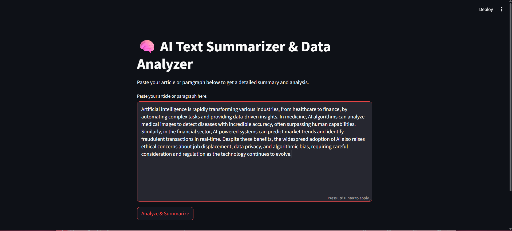
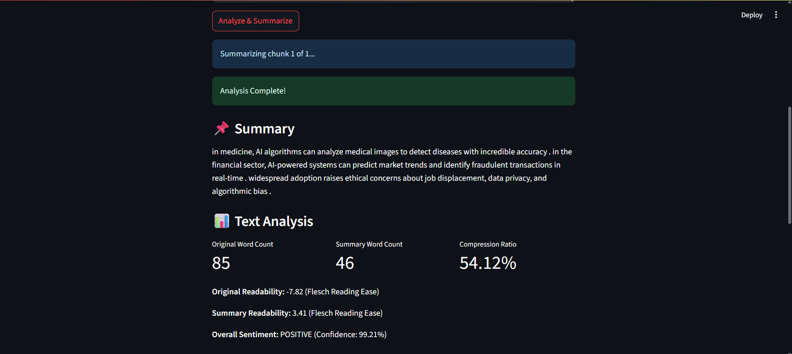
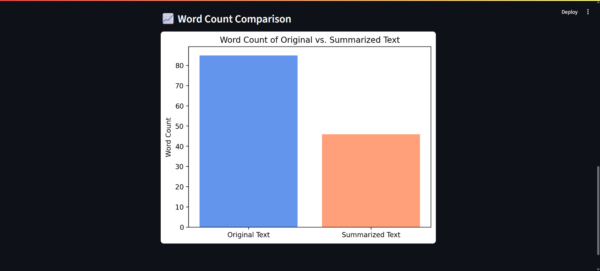

# 🧠 AI Text Summarizer & Analyzer

An interactive **Streamlit app** that not only summarizes long text into clear, concise insights but also provides detailed analysis.  
Built with **Transformers, NLTK, TextStat, and Matplotlib**.  

## Features
- **Smart Summarization**  
  - Handles long documents with hierarchical chunking  
  - Uses `t5-small` for fast summaries (upgradeable to larger models)  

- **Text Analysis**  
  - Word & character counts  
  - Readability score (Flesch Reading Ease)  
  - Compression ratio (original vs. summary)  

- **Sentiment Analysis**  
  - Powered by `distilbert-base-uncased-finetuned-sst-2-english`  

- **Visual Insights**  
  - Side-by-side word count comparison with Matplotlib bar charts  
  
## Screenshots

### 🔹 Input Section

### 🔹 Generated Summary & Analysis

### 🔹 Word Count Comparison

